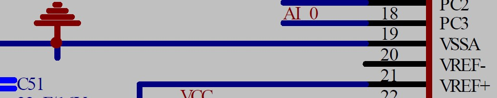

# Station controller

- [Station controller](#station-controller)
  - [更新说明](#更新说明)
  - [简介](#简介)
  - [功能](#功能)
  - [使用方式](#使用方式)
  - [关键点](#关键点)
  - [测试项目](#测试项目)
  - [测试说明](#测试说明)
  - [函数说明](#函数说明)
  - [存在问题](#存在问题)

## 更新说明

| Date       | Author | Note          | Version number |
| ---------- | ------ | ------------- | -------------- |
| 2022.04.07 | LHC    | First edition | V1.0.0         |

## 简介

- 气站控制器主要由 **STM32F103VET6** 和 **迪文屏幕DMT80480T043_01WTR** 两部分构成。
- 硬件IO构成情况：
  - 输入信号分为：``8`` 路数字输入 和 ``8`` 路模拟输入。
  - 输出信号分为：``7`` 路数字输出 和 ``4`` 路模拟输出。
  - 特别说明：
    > 数字输出和模拟输出，目前仅支持远程模块4G进行控制，数字输出（部分引脚占用）受用户逻辑影响。

## 功能

- 气站控制器，通过模拟PLC的外部数据采集策略（数字信号高、低电平和模拟信号4-20mA），映射到内存指定地址，内部从机号(4G远程访问站号)``0x02``。
- 四种信号：数字输入、数字输出、模拟输入、模拟输出均在内存中设有独立地址，操作策略遵循``Modbus``协议约定。
- ``RS485`` 访问站号 ``0x03`` ,目前暂未和站号 ``0x02`` 关联，故内部变量地址并不关联。
- 目前上层用户逻辑，主要通过检测``4``路模拟信号输入，分别组合控制``5``个电磁阀动作。

## 使用方式

- 注意按照IO外部接线图纸，正确连接各部分线路。
- 除用户逻辑占用的部分IO外，剩余输出IO可自由通过远程设置其状态。
- 用户默认登录名为：``2022`` , 密码为 ``1314``。
- 其内部阈值设定界面参数，均与用户逻辑紧密相关，参数设定与选取需查看需求文档后``谨慎``操作。

## 关键点

- 硬件部分：
  - MCU程序下载有时需要下载器提供``+3.3V``电源，尽管此时外部已经接通``+24V``电源。
  - 原理图上存在**错误**：ADC采集时，芯片引脚``-VREF``未与``GND``相连接，造成ADC采样值**正漂移**。
  
  - ADC采样实际通道与DMA实际通道无法很好对应。（软件层已经屏蔽差异）

- 软件部分：

    - **内存地址**映射关系

   | 寄存器组         | 映射对象 | 地址范围      | 操作类型 | 规则     |
   | ---------------- | -------- | ------------- | -------- | -------- |
   | InputCoil        | 数字输入 | 10001 - 19999 | R        | 顺序对应 |
   | Coil             | 数字输出 | 00001 - 09999 | R/W      | 顺序对应 |
   | Input Register   | 模拟输入 | 30001 - 39999 | R        | 顺序对应 |
   | Holding Register | 模拟输出 | 40001 - 49999 | R/W      | 顺序对应 |

   -  **站号** 对应外设
 
    | 站号id | 对应外设                 | 访问参数                | 访问方式 | 访问周期       |
    | ------ | ------------------------ | ----------------------- | -------- | -------------- |
    | 0x02   | 4G云平台                 | 115200 + 无校验位 + CRC | 云端轮询 | 1Min           |
    | 0x02   | 用户线程**Control_Task** | 线程参数                | 内核调度 | 1S             |
    | 0x03   | 外部RS485请求对象        | 9600 + 无校验位 +CRC    | 被动回复 | 发起请求方决定 |

    - 说明：目前应用场景比较简单，内部从站 ``0x03`` 与四种信号实际并无关联。
    - 模拟量与物理量换算关系说明：[CSDN博客](https://blog.csdn.net/weixin_36443823/article/details/112775994)

## 测试项目

- **数字量输入** 和 **数字量输出** 与硬件引脚对应关系。
- **模拟量输入** 对应ADC与电流间关系。
- **模拟量输出** 对应DAC与电流间关系。
- **屏幕各组件** 间地址映射、数据变量下发、上传与阈值界定测试。
- **用户逻辑** 测试各输入物理量与对应电磁阀间动作关系。

## 测试说明

- 模拟量与数字量所有测试均通过。
- 屏幕组件测试通过（控制部分：**数字量输出**和**模拟量输出**并未测试）。
- 用户逻辑，启动模式、停机模式、安全模式基本保障点以按照文档测试通过。（上柜后，出现控制**动作不满足**逻辑组合现象，但后续测试又未复现）

## 函数说明

- 暂略。

## 存在问题

- **4G模块**远程升级暂未实现。
- **Shell**端口内部配置行为未启用。
- **迪文屏幕**对数字量输出和模拟量输出暂未支持。
- **ADC与DAC**参数自动校准程序暂未匹配。